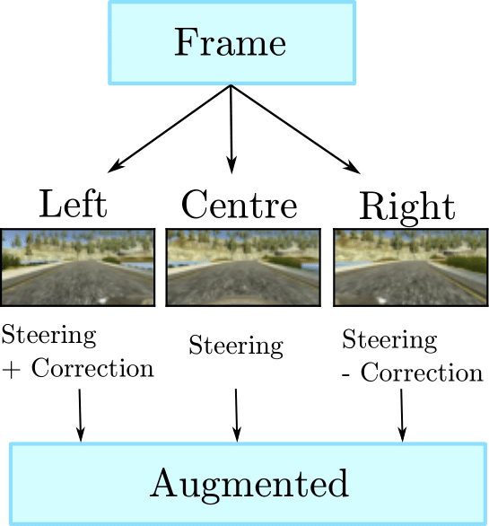
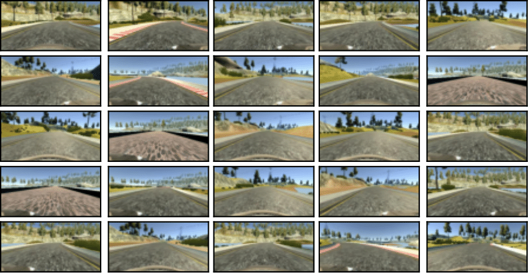
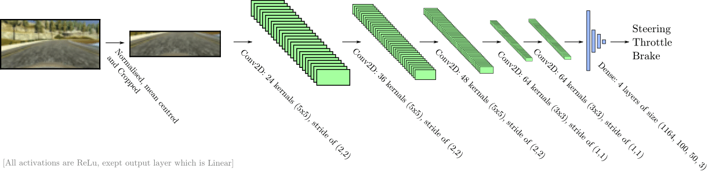

# Self Driving Car: Behavioural Cloning

The goals of this project were the following:

* Generate and augment a behavioural cloning dataset by driving in a simulator.
* Build a deep-learning end-to-end driving model that predicts driving actions from camera data.
* Test, train and validate the model using the simulator driving data.
* Apply the model in the simulator, recording a video of the completion of one lap of the track.

The project directory contains:
* The python source files \texttt{preproc.py}, \texttt{model.py} and \texttt{test.py}, which contains the source code of this implementation. In addition the files \texttt{drive.py} and \texttt{video.py} are used to deploy and record models in the simulator.
* The simulator directory contains the compiled simulator.
* The data directory contains the dataset generated by driving in the simulator.
* The models directory contains the h5 file of the trained model.
* The results directory contains the results and figures, as well as the final video.

## Data Generation and Augmentation
Behavioural cloning models are deep learning frameworks that are trained and tested on a dataset of human generated driving behaviour. In order to generate this dataset I drove the vehicle in the simulator several times around the track. In order to ensure the dataset was as robust as possible I performed two types of lap: a 'perfect as possible (PAP)' lap, and a 'fail and recover (FAR)' lap. A PAP lap consists of driving along the centre of the track as perfectly as I possibly can, illustrating the desired driving behaviour. I would disregard any laps where I made a driving mistake. A FAR lap is one where I intentionally make driving mistakes (but not dangerous driving actions such as mounting the curb) and I recover from that mistake as quickly as possible. An example could include drifting to the edge of the track, and quickly re-centring before I hit the edge. The purpose of the FAR laps is to embed in the dataset information of how to recover once the attempt to drive perfectly has failed. If only the PAP laps were used, any failure of the driving model results in the car driving off the road, as such driving mistakes and subsequent correction would not be percent in the training data, and would be considered an our of distribution failure case. The inclusion of the FAR laps ameliorates this issue, as recovery cases are built into the dataset. The final training dataset consists of 8 PAP laps, and 2 FAR laps.

The structure of the dataset is an entry for each frame of the driving simulation, where the features are the camera data, and the labels are the steering, throttle and brake values. Each is a numerical value, in the case of steering ranging from -1 to 1, where 0 is no steering. The camera data consists of a 160 x 320 three color channel RGB image taken from the camera centred on the screen of the vehicle. A data augmentation used by Nvidia (End-to-End Deep Learning for Self-Driving Cars. Mariusz Bojarski, Ben Firner, Beat Flepp, Larry Jackel, Urs Muller, Karol Zieba and Davide Del Testa) was also employed. This involves each frame also providing two extra camera images, taken from forward-facing cameras mounted at the left and right edges of the vehicle. This is then paired with the steering data at that time frame, with a correction applied, which is positive for the left camera image, and negative for the right. The purpose of this augmentation as to provide built-in correction information. If is essentially teaching the model, if the vehicle was further to the left in this exact frame, you would correct for this be steering towards the right, etc. This allows the model to learn how to correct from being at the very edge of the road, without the training data having to explicitly contain dangerous driving events, that do not want to be replicated. This augmentation is illustrated in the figure above. This augmentation simply triples the size of the dataset, where each frame now has left, centre and right camera and steering data. This dataset is then shuffled. 25 of the total 10500 frames of $x$ data is shown in the figure below. This data is the input of the model, and each image has the corresponding driving controls as the corresponding $y$ label. This data is split into a training, validation and test set of sizes 7200, 1800, and 1500 respectively.

## Building, Testing and Training the Model
The model employs several preprocessing techniques:
* I normalised the images such that the values ranged from 0 to 1 rather than the original 0 to 255. This is because this well aligns the inputs with the sale of the randomly initialised normally distributed weights of the CNN.
* I ensured the data was centred around a mean of zero, insuring that it would result in a statistically well behaved training process.
* The images are then cropped to remove distracting data above the horizon.
* The data is finally shuffled.
The model architecture is a transfer learning of the Nvidia (End-to-End Deep Learning for Self-Driving Cars. Mariusz Bojarski, Ben Firner, Beat Flepp, Larry Jackel, Urs Muller, Karol Zieba and Davide Del Testa)  end-to-end driving model. All layers were retrained using the training data.
* Input: shape = (160, 320, 3)
* Cropping layer: output shape = (90, 320, 3)
* Convolution layer:  output shape = (43, 158, 24), activation = relu
* Convolution layer:  output shape = (20, 77, 36), activation = relu
* Convolution layer:  output shape = (8, 37, 48), activation = relu
* Convolution layer:  output shape = (6, 35, 64), activation = relu
* Convolution layer:  output shape = (4, 33, 64), activation = relu
* Flatten layer: output shape = (8448)
* Fully connected layer: output shape = (1164), activation = relu
* Fully connected layer: output shape = (100), activation = relu
* Fully connected layer: output shape = (50), activation = relu
* Fully connected layer: output shape = (3)
The hyper-parameters of the model are: EPOCHS = 5, BATCH_SIZE = 128, LEARNING_RATE = 0.0005. Theses values were tuned to prevent over-fitting. Adding dropout layers had an adverse effect on driving behaviours, so a small epoch training with no dropout performed far better and showed no signs of over-fitting. The figure below shows an illustration of the model architecture.

The models, training, validation and test scores are:
- Training Loss =  0.0263
- Validation Loss = 0.0606
- Test Loss = 0.0287

## Applying the model to the simulator
The model was then applied to the simulator. It performs very well, driving laps of the track keeping to the centre of the road, and making accurate cornering actions and recovery actions, never leaving the driving area, and with a smooth driving style with little to no steering wobble. A video of the model performing a complete lap of the track is included in the results directory.
\includegraphics[scale=1.2]{results/model.pdf} 
